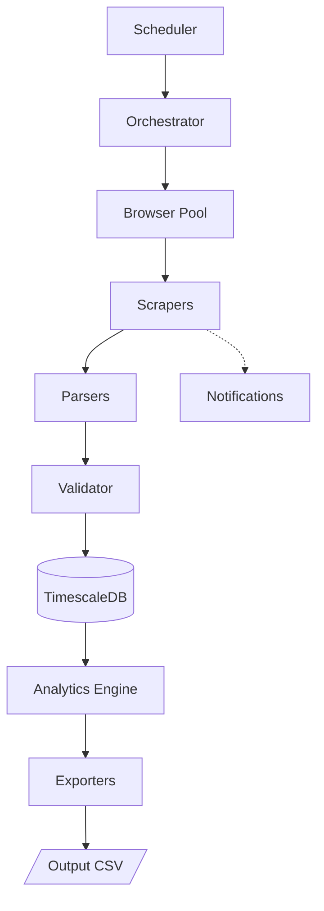

# CME Analytics Engine

A robust, production-grade automated pipeline for fetching, parsing, and analyzing CME market data (Options, Futures Open Interest, Intraday OHLCV, and Daily Settlement).

## Current Handoff Status (2026-06-16)

- GoldQuant integration contract is latest/current-file first: top-level output filenames remain stable for consumer apps.
- CSV exporters now write two copies when data is available:
  - current file, for example `output/options/GC_options_20260616.csv`
  - archive snapshot, for example `output/options/archive/20260616/GC_options_20260616_153000.csv`
- Vol2Vol keeps `output/vol2vol/vol2vol_summary_latest.json` as the consumer pointer and archives daily/raw/structured JSON snapshots.
- Current known integration blocker: GoldQuant can read GC Vol2Vol and GC intraday `1m`; current GC options/OI exports still need to be generated before full real-data graph/paper validation.

## 🚀 Key Features

- **Multi-Source Scraping**: High-resilience scraping using `camofox-browser` with stealth capabilities and fallback REST API calls.
- **Advanced Analytics**: Real-time calculation of **Max Pain**, **GEX (Gamma Exposure)**, **IV Rank**, and **IV Percentile**.
- **TimescaleDB Integration**: Efficient storage of high-frequency intraday bars and large option chains with automated retention policies.
- **Resilient Scheduler**: Multi-stage scheduling logic (Intraday → Options → OI → Settlement) with built-in retries and circuit breakers.
- **Production Ready**: Fully dockerized environment with health checks and structured logging.

## 🏗 Architecture



## 📂 Project Structure

```text
cme-analytics-engine/
├── config/                  # Server configuration templates
├── dashboard/               # Dashboard frontend and web server
├── src/                     # Main TypeScript source code
│   ├── __tests__/           # Unit and integration test suites
│   ├── analytics/           # Financial analytics (Black76, GEX, MaxPain, IVRank, Indicators, VolatilitySurface)
│   ├── backtest/            # Backtesting engine and trading strategies
│   ├── browser/             # Stealth browser pooling and proxy interceptors
│   ├── config/              # Environment configurations and trading symbols
│   ├── db/                  # Database clients, repositories, and TimescaleDB migrations
│   ├── exporters/           # CSV and summary data exporters
│   ├── notifications/       # Slack and Line notification handlers
│   ├── parsers/             # Data validation and parsing logic
│   ├── scrapers/            # Web scraping modules (Option chains, Settlement, Open Interest)
│   ├── utils/               # Common helper utilities (Logger, CircuitBreakers, HolidayCalendars)
│   ├── main.ts              # Entrypoint script
│   ├── orchestrator.ts      # Main pipeline execution orchestrator
│   ├── scheduler.ts         # Intraday and daily job scheduler
│   └── types.ts             # Shared TypeScript type declarations
├── scripts/                 # Utility scripts for data backfill and analysis recomputation
├── Dockerfile               # Containerization configuration
└── docker-compose.yml       # Docker environment configuration with TimescaleDB
```

## 🛠 Setup

### Prerequisites
- Node.js 20+
- Docker & Docker Compose
- Residential Proxy (recommended for production scraping)

### Installation
1. Clone the repository
2. Copy `.env.example` to `.env` and configure variables.
3. Install dependencies:
   ```bash
   npm install
   ```

### Running with Docker (Recommended)
```bash
docker-compose up -d
```

#### 📂 Docker Volume Sync
The `docker-compose.yml` maps host directories to the container:
- `./output` ➔ `/app/output` (Scraper output files e.g., `vol2vol`, `oi`, `options` CSVs)
- `./logs` ➔ `/app/logs` (Run and debug logs)
- `./errors` ➔ `/app/errors` (Screenshots captured when scraping errors occur)
- `./config` ➔ `/app/config` (CME login cookies and configs)

All files written by the scraper inside Docker will automatically sync back to the host machine's `./output` directory.

#### 🔑 CME Cookie Login & MFA (Crucial ⚠️)
Because the browser runs in headless mode inside Docker, you cannot solve MFA/Login challenges directly within the container:
1. When cookies expire, run the login helper **locally on the host machine (Windows)**:
   ```bash
   npm run script:cme-login
   ```
2. Log in and solve the MFA challenge in the visual Chrome window that opens.
3. The script will save updated cookies to `./config/cme-cookies.json`, which instantly syncs to the container. No restart or rebuild is required.

#### 🔌 Connecting Consumer Applications (e.g., GoldQuant)
If consumer applications (like the `GoldQuant` trading bot) read the exported CSVs:
- **Local Run**: Set `CME_OUTPUT_DIR=D:/GetDataCMEBoy/output` in the consumer's `.env`.
- **Docker Run**: Mount the directory as a volume (`d:/GetDataCMEBoy/output:/cme_data:ro`) and set the environment variable `CME_OUTPUT_DIR=/cme_data` in the consumer's `docker-compose.yml`.


### Running Locally
```bash
# Run migrations
npm run db:migrate

# Start the fetcher
npm start
```

## 📖 CLI Usage

| Command | Description |
|---------|-------------|
| `npm start` | Run the main scheduler |
| `npm run backfill -- --symbol ES --days 30` | Backfill historical data |
| `npm run recompute` | Recalculate analytical metrics |
| `npm run test` | Execute full test suite |

## 📊 Data Dictionary

### Options Chain (`options_chain`)
- `trade_date`: The official market date for the data.
- `strike`: Option strike price.
- `option_type`: 'C' (Call) or 'P' (Put).
- `last_price`, `settle_price`: Pricing data.
- `open_interest`, `oi_change`: Market participation metrics.
- `delta`, `gamma`, `theta`, `vega`: Calculated Greeks.
- `moneyness`: ITM, ATM, or OTM classification.

### OI Summary (`oi_expiry_summary`)
- `max_pain`: The strike where option sellers incur minimum payout.
- `net_gex`: Total dealer gamma exposure.
- `gex_flip`: The price level where volatility profile changes.
- `iv_rank`: Current IV relative to 52-week range.

## ⚠️ Troubleshooting

See [RUNBOOK.md](./RUNBOOK.md) for detailed troubleshooting steps regarding bot detection, database connectivity, and browser issues.

---
Developed as part of the CME Data Fetcher Project.
