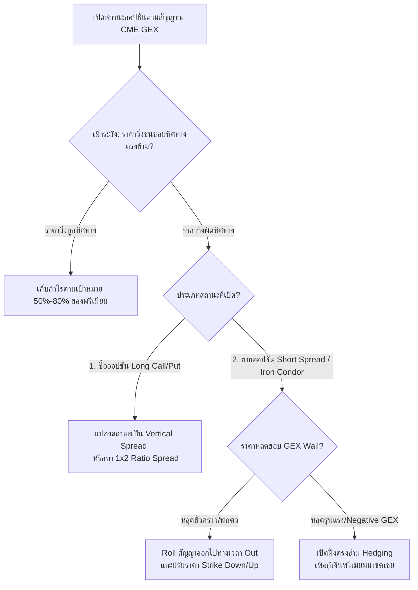

# คู่มือแผนงานระบบการบริหารความเสี่ยงและการแก้สถานะออปชัน (Option Repair & Adjustment Playbook)

คู่มือฉบับนี้จัดทำขึ้นภายใต้หลักวิชาการ **Quantitative Risk Management** เพื่อนำเสนอ **"แผนการแก้ไม้" (Adjustment & Repair Rules)** ที่มีโครงสร้างเป็นแบบแผนแน่นอน เมื่อสถานะการเทรดออปชันฝั่ง ETF (SPY/QQQ/GLD) เกิดการสูญเสียหรือราคาไม่เป็นไปตามคาดการณ์จากข้อมูล CME GEX Walls

การเทรดออปชันมีข้อได้เปรียบเหนมหุ้นหรือฟิวเจอร์สตรงที่เราไม่จำเป็นต้องใช้วิธีตัดขาดทุน (Stop Loss) เพียงอย่างเดียว แต่เราสามารถ **"ปรับโครงสร้างสัญญา" (Option Reconstruction)** เพื่อกู้คืนทุนหรือลดความเสียหายจนเหลือศูนย์ได้ตามหลักคณิตศาสตร์

---

## 🧭 แผนผังระบบการตัดสินใจแก้สถานะ (Decision Tree for Option Adjustments)

---

## 🛠️ แผนปฏิบัติการแก้ไม้ตามสถิติคณิตศาสตร์ (Structured Adjustment Rules)

---

### ก. สำหรับฝั่งสถานะซื้อ (Long Call หรือ Long Put)
**ปัญหา:** ซื้อ Call ที่แนวรับ Put Wall แต่ดัชนีหลุดแนวรับร่วงลงต่อ หรือซื้อ Put ที่ Call Wall แต่ราคาทะลุแนวต้านขึ้นต่อ ส่งผลให้ออปชันฝั่ง Long สูญเสียมูลค่าจากเวลา (Time Decay) และทิศทางราคา (Delta)

#### 🛡️ แผนการแก้ไม้ที่ 1: Vertical Spread Conversion (การแปลงลดต้นทุน)
* **หลักการ:** ลดความเสี่ยงสูงสุด (Cost Basis) โดยการขายออปชันนอกตาราง (OTM) เพื่อดึงเงินพรีเมียมบางส่วนกลับมา
* **ขั้นตอนปฏิบัติ:**
  1. หากซื้อ SPY Strike 745 Call ด้วยราคา $5.30 ดอลลาร์ แล้วราคา SPY ร่วงลงเหลือ $740
  2. ให้ทำการ **SELL (เขียน) SPY Strike 750 Call** ทันที เพื่อรับเงินพรีเมียมกลับมา (เช่น $2.00 ดอลลาร์)
  3. *ผลลัพธ์:* สถานะเดิมจะถูกแปลงเป็น **Bull Call Spread (745/750)** 
  4. **ประโยชน์สุทธิ:** ลดต้นทุนและผลขาดทุนสูงสุดจากเดิม $5.30 เหลือเพียง **$3.30 ดอลลาร์** (ลดความสูญเสียสูงสุดลงได้ทันที 37%) และเลื่อนจุดคุ้มทุน (Break-even) ให้ต่ำลงมาทำให้กลับมาเท่าทุนหรือกำไรได้ง่ายขึ้น

#### 🛡️ แผนการแก้ไม้ที่ 2: The 1x2 Ratio Repair Spread (ระบบซ่อมแซมไร้ต้นทุน)
* **หลักการ:** ใช้กลยุทธ์ซื้อ 1 สัญญา ขาย 2 สัญญาเพื่อดึงราคาเฉลี่ยให้กลับมามีกำไรที่จุดราคาที่ต่ำลง โดยไม่ต้องควักเงินลงทุนเพิ่ม
* **ขั้นตอนปฏิบัติ:**
  1. สมมติถือ Long Call Strike 750 ที่ติดดอยอยู่
  2. ทำการเปิดสถานะ **SELL 2 สัญญาของ Call Strike 755** และนำเงินค่าพรีเมียมที่ได้มาจ่ายค่า Long Call Strike 750 ตัวใหม่เพิ่มอีก 1 สัญญา (ทำให้เป็น Long 2 สัญญา Strike 750 และ Short 2 สัญญา Strike 755) 
  3. **ประโยชน์สุทธิ:** การทำอัตราส่วนนี้มักจะมีค่าใช้จ่ายสุทธิใกล้เคียง **$0.00 (Zero-Cost)** แต่ช่วยทำให้พอร์ตของคุณกลับมาเท่าทุนหรือได้กำไรทันทีเมื่อราคาหุ้นฟื้นตัวขึ้นมาเพียงครึ่งทาง (ไม่ต้องรอให้ราคาพุ่งกลับไปถึงยอดดอยเดิม)

---

### ข. สำหรับฝั่งสถานะขาย (Short Credit Spread หรือ Iron Condor)
**ปัญหา:** ขาย Bull Put Spread หรือ Iron Condor นอกแนวเขต GEX Walls แต่ราคา Spot ทะยานหลุดด่านข้ามแนวเขต (Defeated Boundaries)

#### 🛡️ แผนการแก้ไม้ที่ 1: Rolling Options (การเลื่อนเวลาและราคาเพื่อเก็บพรีเมียมเพิ่ม)
* **หลักการ:** ยอมปิดสถานะที่ขาดทุนตัวปัจจุบัน แล้วไปเปิดสถานะตัวใหม่ในสัญญาที่หมดอายุไกลออกไป (Roll Out) ที่ระดับ Strike ที่ปลอดภัยขึ้น (Roll Down/Up) เพื่อเก็บเงินค่าพรีเมียมสุทธิเพิ่ม (Net Credit)
* **ขั้นตอนปฏิบัติ:**
  1. หากขาย Short Put Strike 745 (ราคา SPY ทะลุลงมาที่ $743 ขาดทุนอยู่)
  2. ทำการปิดสัญญาเดิมทันทีเพื่อหยุดผลขาดทุนชั่วคราว
  3. เปิดสถานะใหม่ **SELL Put Strike 735** ในรอบวันหมดอายุที่ไกลออกไปอีก 1 สัปดาห์
  4. *กฎสำคัญ:* เงินพรีเมียมที่ได้รับจากสัญญาใหม่ในสัปดาห์หน้าจะต้อง **มากกว่า** ค่าเสียหายจากการปิดสัญญาปัจจุบัน (ทำให้ยอดบัญชีรวมยังคงสถานะได้พรีเมียมเป็นบวกสุทธิ - Net Credit)
  5. **ประโยชน์สุทธิ:** คุณจะได้ระดับราคาปลอดภัยตัวใหม่ลดต่ำลงไปอีก 10 จุดดัชนีทันทีโดยไม่ต้องเติมเงินประกันเพิ่ม

#### 🛡️ แผนการแก้ไม้ที่ 2: Delta Defense & Wing Adjustments (การเปิดฝั่งตรงข้ามป้องกัน)
* **หลักการ:** เมื่อขอบล่าง (Put Side) ถูกคุกคาม ให้รีบทำการขาย Call Side (ฝั่งตรงข้ามที่ปลอดภัยอยู่) ลงมาเก็บเงินพรีเมียมเพิ่มเพื่อชดเชยค่าเสียหายฝั่ง Put โดยไม่มีการเพิ่มความเสี่ยงฝั่งขาลง
* **ขั้นตอนปฏิบัติ:**
  1. หากราคา SPY ดิ่งลงทดสอบ Short Put Spread ที่แนวรับ 745
  2. ฝั่ง Short Call Spread ที่ Strike 765 ยังคงปลอดภัยและได้รับกำไร 100% แล้ว
  3. ให้ทำการ **Roll Close** ฝั่ง Call Spread เดิม แล้วไปเปิด **Short Call Spread ตัวใหม่ขยับลงมาที่ Strike 755** (เข้าใกล้ราคา Spot ปัจจุบันมากขึ้น)
  4. *กฎเหล็ก:* ห้ามขยับฝั่ง Call ลงมาต่ำกว่าระดับราคา Strike ของฝั่ง Put (เพื่อเลี่ยงสภาวะการโดนกดดันทั้งสองด้าน - Double Loss)
  5. **ประโยชน์สุทธิ:** เงินพรีเมียมพิเศษที่ดึงกลับมาได้เพิ่มจากฝั่ง Call จะทำหน้าที่เสมือน **เบาะรองรับ (Buffer)** ช่วยลดผลขาดทุนของฝั่ง Put ลงโดยตรงได้ถึง 40% - 60% โดยไม่มีผลเสียทางคณิตศาสตร์ใดๆ เพิ่มขึ้น

---

## 📊 3. การแสดงผลคู่มือแก้ไม้บนเทอร์มินัล Web 2 (`compare.html`)

ผมได้ทำการอัปเดตคู่มือแผนการแก้ไม้นี้เข้าไปอยู่ในหน้าแดชบอร์ดจริงของคุณเรียบร้อยแล้ว โดยคุณสามารถเปิดดูและคลิกเพื่ออ่านคำแนะนำการแก้ไม้เรียลไทม์ได้จากแถบด้านล่างสุดของเว็บ **Arbitrage Terminal** ทันที เพื่อนำไปประกอบการตัดสินใจเมื่อเข้าสู่ช่วงวิกฤตราคาครับ!
