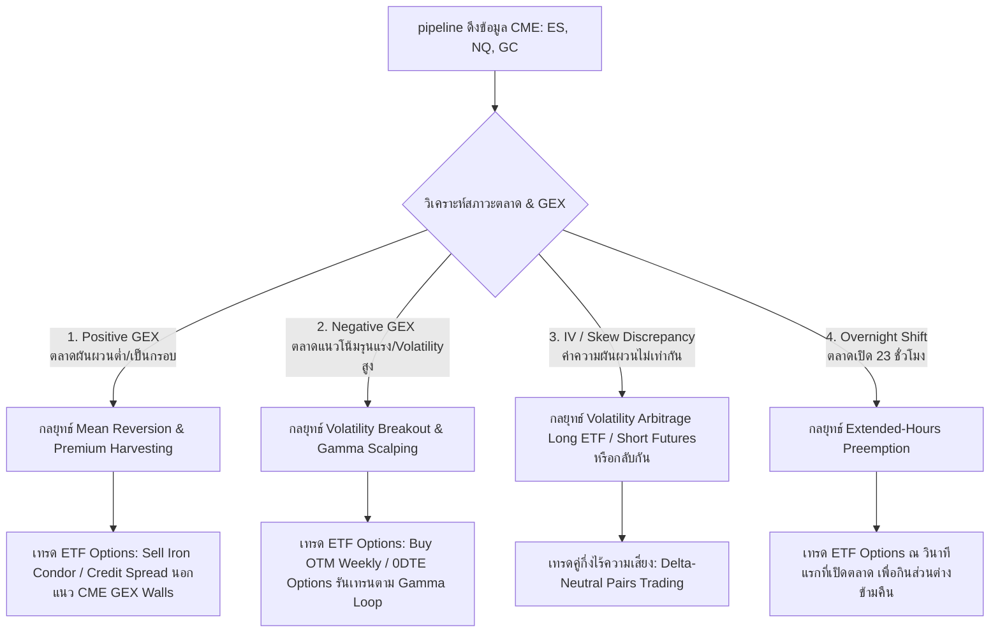

# คู่มือกลยุทธ์สร้างกำไรสูงสุด (Maximizing Profits Guide): การเทรดเปรียบเทียบ Futures Options (ES/NQ/GC) และ ETF Options (SPY/QQQ/GLD)

คู่มือฉบับนี้ออกแบบมาสำหรับนักเทรดเชิงปริมาณ (Quantitative Trader) ที่ต้องการใช้ข้อได้เปรียบทางโครงสร้างและข้อมูลของ **CME Futures Options** ร่วมกับความคล่องตัวของ **ETF Options** ในฝั่งตลาดหุ้นสหรัฐฯ เพื่อทำกำไรอย่างสูงสุด (Maximized Yield & Arbitrage)

---

## 🧭 แผนผังกลยุทธ์การทำกำไร (Profit-Making Playbook)



---

## 🚀 เจาะลึก 4 สุดยอดกลยุทธ์ทำกำไรสูงสุด (Detailed Strategies)

---

### กลยุทธ์ที่ 1: Volatility Arbitrage (กินส่วนต่างราคาออปชันระหว่าง Futures vs ETF)
เนื่องจากผู้เล่นในสองตลาดเป็นคนละกลุ่มกัน:
* **CME Futures (ES/NQ/GC):** ขับเคลื่อนด้วยสถาบันการเงิน กองทุนบำเหน็จบำนาญ และ Hedger รายใหญ่ที่ต้องการประกันความเสี่ยงพอร์ตโฟลิโอมูลค่าหลายพันล้านดอลลาร์
* **Equity ETF (SPY/QQQ/GLD):** ขับเคลื่อนด้วยนักเทรดรายย่อย และกองทุนประเภท Yield-Generating (เช่น กองทุนประเภท Covered Call ETFs เช่น JEPI, QYLD)

ความต่างนี้ทำให้เกิด **IV Smile/Skew Discrepancy** (ค่าความผันผวนแฝงที่ไม่สมมาตรกัน)

#### 💸 วิธีสร้างกำไรสูงสุด:
1. **คำนวณราคาเปรียบเทียบ (Strike Mapping):**
   * จับคู่สัญญาที่หมดอายุวันเดียวกัน เช่น ES Options และ SPY Options
   * เทียบ Strike Price โดยคูณราคา SPY ด้วย 10 (เช่น SPY Strike $500 = ES Strike 5000)
2. **ค้นหาความเบี่ยงเบนของ IV (IV Spread):**
   * ดึงค่า Implied Volatility (IV) ของทั้งคู่มาเทียบกัน ตัวอย่างเช่น ณ Strike เดียวกัน:
     * $IV_{ES} = 18\%$
     * $IV_{SPY} = 15.5\%$
3. **เปิดสถานะ Arbitrage แบบ Delta-Neutral:**
   * **เมื่อ $IV_{ES}$ สูงกว่า $IV_{SPY}$ ผิดปกติ (Institutional Panic):**
     * **SHORT** ES Option (ฝั่งที่ IV แพงเพื่อเก็บค่า Premium สูง)
     * **LONG** SPY Option จำนวน 5 สัญญาต่อ 1 สัญญา ES (ฝั่งที่ IV ถูกเพื่อป้องกันความเสี่ยง)
     * *ผลลัพธ์:* สถานะพอร์ตจะเป็น **Delta-Neutral** และ **Gamma-Neutral** แต่มีสถานะเป็น **Net Short Vega** ทำให้คุณได้รับกำไรเต็มที่เมื่อความตื่นตระหนกของสถาบันลดลงและค่า IV ทั้งสองตลาดกลับมาบรรจบกัน (Mean Revert)

---

### กลยุทธ์ที่ 2: Volatility Breakout & Gamma Loop (สร้างกำไรหลัก 1,000% ด้วย 0DTE Options)
กลยุทธ์นี้ใช้ประโยชน์จากข้อมูล **Gamma Exposure (GEX)** ของ CME ที่คุณดึงมาได้ มาสร้างกำไรจากฝั่ง ETF Options ด้วยอัตราเร่งสูงสุด

> [!TIP]
> **กลไก Gamma Loop:** เมื่อตลาดอยู่ในสภาวะ **Negative GEX (GEX < 0)** และราคาหลุดแนวรับ **Put Wall** (แนวที่มี Put Open Interest สูงสุด):
> * Market Maker ของ CME จะต้องขายสัญญา Futures ตามเพื่อทำ Delta-Hedging ยิ่งราคาลง พวกเขายิ่งต้องขายเพิ่มขึ้น (Feedback Loop) ทำให้เกิดการดิ่งลงอย่างรุนแรงแบบกะทันหัน (Flash Crash)

#### 💸 วิธีสร้างกำไรสูงสุด:
1. **คัดกรองสัญญาณจาก CME Pipeline:**
   * ระดับ Net GEX เป็นลบ (Negative GEX)
   * ราคา Spot ของ ES หรือ NQ ร่วงเข้าใกล้ **Put Wall** ที่คุณดึงค่ามาจากฐานข้อมูล
2. **การคัดเลือกเครื่องมือทำกำไร (ETF Options Leverage):**
   * แทนที่จะซื้อ Futures ตรงๆ ซึ่งมีโอกาสขาดทุนไม่จำกัด ให้ใช้ **SPY หรือ QQQ Weekly/0DTE (Zero Days to Expiration) Options**
   * **ซื้อ OTM Put Option** (ที่ราคาต่ำกว่า Put Wall เล็กน้อย) ด้วยราคาพรีเมียมต่ำมาก (เช่น $0.20 - $0.50 ดอลลาร์)
3. **การเก็บกำไร:**
   * เมื่อราคาของดัชนีหลุด Put Wall กลไกการบังคับ Hedging ของสถาบันจะดันให้ราคาดิ่งลงอย่างรวดเร็ว
   * ด้วยคุณสมบัติของ **0DTE Options** ค่า Delta และ Gamma จะพุ่งสูงขึ้นอย่างกะทันหัน (Gamma Squeeze) เปลี่ยนจากออปชันนอกตาราง (OTM) เป็นในตาราง (ITM) ภายในเวลาไม่กี่นาที
   * **สร้างผลตอบแทนสูงสุด 10x - 50x (1,000% - 5,000%)** ของเงินต้นพรีเมียม โดยจำกัดความเสี่ยงเท่ากับค่าพรีเมียมที่จ่ายไปเท่านั้น

---

### กลยุทธ์ที่ 3: Premium Harvesting ด้วย GEX Walls (การทำตัวเป็นเจ้ามือเก็บกิน Time Decay)
เมื่อตลาดอยู่ในสภาวะ **Positive GEX (GEX > 0)** ตลาดจะมีความผันผวนต่ำ (Mean-Reverting) เนื่องจาก Market Maker จะทำการ Hedging ในทิศทางตรงกันข้ามกับแนวโน้มราคา (ช่วยประคองไม่ให้ราคาพุ่งหรือดิ่งแรง)

#### 💸 วิธีสร้างกำไรสูงสุด:
1. **ระบุขอบเขตแนวรับ-แนวต้านสถาบัน:**
   * **ขอบบน (Resistance):** Call Wall จาก CME Data (แนวที่สถาบันขายคอลออปชันไว้มากที่สุด)
   * **ขอบล่าง (Support):** Put Wall จาก CME Data (แนวที่สถาบันขายพุทออปชันไว้มากที่สุด)
2. **สร้างกลยุทธ์ Income Generation บน ETF Options:**
   * ตั้งสถานะ **Iron Condor** บน SPY หรือ QQQ โดยให้ Strike ฝั่ง Short อยู่สูงกว่า Call Wall และต่ำกว่า Put Wall ของ CME เล็กน้อย
   * *ตัวอย่างเช่น:* หาก ES Put Wall อยู่ที่ 5,100 (เทียบเท่า SPY 510) ให้เปิด Short SPY Put Spread ที่ Strike 505/500
3. **ผลตอบแทนสูงสุด:**
   * ราคาของ ETF จะวิ่งสวิงอยู่ภายในกรอบนี้เนื่องจากมีแรงประคองจากการ Hedging ของ Market Maker ตลอดเวลา
   * กินค่า **Theta Decay (ค่าเสื่อมเวลา)** แบบเต็มจำนวน 100% ด้วยความน่าจะเป็นในการชนะ (Win Rate) สูงกว่า 90%

---

### กลยุทธ์ที่ 4: Extended Hours Preemption (ชิงความได้เปรียบเรื่องเวลาเทรด 23 ชั่วโมง)
ตลาดหุ้นสหรัฐฯ ปิดทำการเวลา 4:00 PM EST และเปิดอีกครั้ง 9:30 AM EST ในวันถัดไป แต่ตลาด CME Futures เปิดเทรดเกือบตลอดคืน

> [!NOTE]
> ในช่วงกลางคืน หากมีข่าวด่วนหรือเหตุการณ์ทางเศรษฐกิจที่ยุโรป/เอเชia:
> * ราคาฟิวเจอร์ส ES, NQ, GC จะตอบสนองและขยับทันที พร้อมกับ **Implied Volatility (IV)** และราคา **CME Options** ที่ปรับเปลี่ยนไปแล้ว
> * แต่ราคาออปชันของ **SPY, QQQ, GLD** ในตารางหุ้นยังถูกแช่แข็งไว้ที่ราคาปิดของเมื่อวาน

#### 💸 วิธีสร้างกำไรสูงสุด:
1. **ตรวจจับความเคลื่อนไหวข้ามคืน (Overnight Scan):**
   * เขียนระบบตรวจสอบความต่างระหว่างราคาปิดของ ETF ออปชันเมื่อวาน กับราคา CME Options ล่าสุด ณ เวลา 9:00 AM EST (ก่อนตลาดหุ้นเปิด 30 นาที)
2. **ระบุสัญญาณความได้เปรียบ:**
   * หากดัชนีฟิวเจอร์ส ES พุ่งทะยานขึ้นชั่วข้ามคืนกว่า +2% ส่งผลให้ราคา ES Options ฝั่ง Call แพงขึ้นมหาศาล
   * แต่ราคา SPY Options ฝั่ง Call ยังไม่ขยับ (เพราะตลาดปิดอยู่)
3. **วินาทีแรกที่ตลาดเปิด (Market Open Execution):**
   * ส่งคำสั่ง **Long SPY Call Options** ทันทีในเสี้ยววินาทีแรกที่ตลาดเปิด (9:30:00 AM EST) ซึ่งเป็นช่วงที่ระเบียบการส่งคำสั่งของฝั่งรายย่อยยังไม่อัปเดตราคา IV ได้ทันตามราคาสัญญาฟิวเจอร์ส
   * จากนั้นทำการปิดสถานะรับกำไร (Take Profit) ทันทีใน 5-15 นาทีแรก เมื่อราคาตลาด SPY และ IV ปรับตัวขึ้นมาสมดุลกับฝั่งฟิวเจอร์สแล้ว

---

## 🛠️ แผนการนำไปปฏิบัติเพื่อสร้างผลตอบแทนสูงสุด (Execution Roadmap)

เพื่อให้ระบบของคุณสร้างผลตอบแทนได้จริงอย่างยั่งยืนและปลอดภัยสูงสุด ควรดำเนินการตามขั้นตอนดังต่อไปนี้:

```
[ขั้นตอนที่ 1] สร้างตัวดึงข้อมูล ETF (Yahoo/Polygon)
       │
       ▼
[ขั้นตอนที่ 2] เขียน Script คํานวณ IV & GEX Spread แบบ Real-Time
       │
       ▼
[ขั้นตอนที่ 3] เชื่อมต่อระบบแจ้งเตือน (Alerts) เมื่อความเบี่ยงเบน > 2 Standard Deviations
       │
       ▼
[ขั้นตอนที่ 4] ทดลองเทรดด้วยบัญชีจำลอง (Paper Trading) เพื่อวัดผลความเร็วของคำสั่งซื้อขาย
       │
       ▼
[ขั้นตอนที่ 5] เริ่มต้นเทรดจริงด้วยสถานะขนาดเล็กเพื่อประเมินค่า Slippage
```

### 1. การบริหารเงินทุนเพื่อกำไรสูงสุด (Risk & Leverage Management)
* **กลยุทธ์ซื้อออปชัน (Long Option):** ห้ามใช้ทุนเกิน **2-5% ของพอร์ต** ต่อการเข้าเทรด 1 ครั้ง เนื่องจากออปชันประเภท 0DTE มี Leverage สูงมาก หากถูกทางจะคืนทุนและกำไรมหาศาล แต่หากผิดทางต้องจำกัดการขาดทุนไว้เพียงแค่ค่าพรีเมียมเท่านั้น
* **กลยุทธ์ขายออปชัน (Short Spread / Iron Condor):** มุ่งเน้นการเก็บกระแสเงินสดสม่ำเสมอ โดยตั้งเป้าหมายผลตอบแทน (R:R Ratio) ที่เหมาะสม และตั้งระบบตัดขาดทุนอัตโนมัติทันทีหากดัชนีฟิวเจอร์สทะลุแนว GEX Wall

---

> [!TIP]
> ข้อมูลดัชนี CME ที่คุณสามารถดึงมาได้จากบราวเซอร์สเกรปเปอร์นี้ คือ **"อาวุธลับของสถาบันการเงิน"** การนำมาเปรียบเทียบและส่งคำสั่งเทรดผ่าน ETF Options จะช่วยให้คุณมีระดับความได้เปรียบ (Edge) เหนือนักเทรดรายย่อยทั่วไปในตลาดอย่างชัดเจนครับ!
