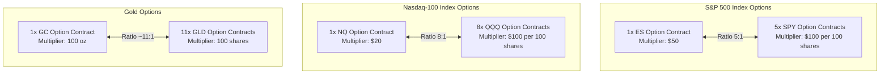

# Quantitative Derivatives Comparison: Futures Options (ES, NQ, GC) vs. ETF Options (SPY, QQQ, GLD)

Yes, comparing the CME data obtained from your pipeline (for **ES, NQ, and Gold/GC**) against their equity-equivalent ETF options (**SPY, QQQ, and GLD**) is not only highly possible but is one of the most powerful analyses a quantitative trader can perform. 

Since the underlying assets are highly co-integrated (futures prices track the spot index/commodity price with a small basis spread due to carry costs), the options chains reflect the same fundamental pricing and Greeks. However, their structural, financial, and regulatory designs differ significantly.

This document provides a comprehensive quantitative framework to compare these two options universes, detailing their mathematics, capital efficiencies, risk profiles, and implementation blueprints for your CME Data Fetcher pipeline.

---

## 1. Quantitative Architecture Comparison

| Dimension | CME Futures Options (ES / NQ / GC) | Equity ETF Options (SPY / QQQ / GLD) | Quantitative / Trading Implications |
| :--- | :--- | :--- | :--- |
| **Underlying Asset** | CME Futures Contract (E-mini / COMEX Gold) | Equity ETF (SPDR / Invesco) | Futures have a rolling basis; ETFs hold physical assets/baskets. |
| **Notional Scaling Ratio** | **5:1** (ES to SPY)<br>**8:1** (NQ to QQQ)<br>**~11:1** (GC to GLD) | **1:1** | A single futures contract controls significantly more notional value (detailed in Section 2). |
| **Margin System** | **SPAN Margin** (Risk-based portfolio margin) | **Reg T** (Strategy-based) or **Portfolio Margin** | SPAN is extremely capital-efficient, offsetting futures positions directly against options. |
| **Tax Treatment (US)** | **Section 1256** (60% Long-Term / 40% Short-Term) | Standard Capital Gains | Section 1256 yields a maximum tax rate ~10-12% lower than standard short-term gains. |
| **Trading Hours** | Near 24/7 (23 hours/day, 5 days/week) | Regular Market Hours (9:30 AM – 4:00 PM EST) | Futures options allow hedging and active trading during major overnight macro events. |
| **Settlement Style** | Typically Cash-Settled (weekly/PM) or Futures Delivery | Physical Share Settlement | Futures options avoid the "pin risk" of receiving physical shares, settling to cash or active futures. |
| **Exercise Style** | European (mostly Weeklies/PM) or American | American | European style eliminates early assignment risk, making multi-leg spreads safer to hold to expiry. |

---

## 2. The Mathematics of Greeks & Contract Scaling

When comparing GEX (Gamma Exposure) or DEX (Delta Exposure) between the CME data you fetch and equity options, you must apply the correct scaling factors. Because the multipliers differ, the absolute value of Greeks ($1$ Delta or $1$ Gamma) does not represent the same dollar exposure.



### Mathematical Scaling Formulas

#### A. S&P 500: ES vs. SPY
* **ES Option Notional**: $\text{Index Price} \times \$50$
* **SPY Option Notional**: $\text{SPY Share Price} \times 100 \text{ shares} = \frac{\text{Index Price}}{10} \times 100 = \text{Index Price} \times \$10$
* **Greeks Scaling Factor**:
  $$\text{1 ES Contract} = 5 \times \text{SPY Contracts}$$
  > [!IMPORTANT]
  > Many retail traders incorrectly assume the ratio is 10:1 because SPY is 1/10th of the S&P 500 index. However, because a SPY option controls 100 shares (creating a 10x multiplier effect on the 1/10th index price), the actual notional ratio is exactly **5:1**. 
  > - **ES Delta of 0.50** = $\$2,500$ exposure per index point move.
  > - **5 SPY Deltas of 0.50** = $5 \times (0.50 \times 100) \times \$1 = \$2,500$ exposure per index point move.

#### B. Nasdaq-100: NQ vs. QQQ
* **NQ Option Notional**: $\text{Index Price} \times \$20$
* **QQQ Option Notional**: $\text{QQQ Share Price} \times 100 \text{ shares} \approx \frac{\text{Index Price}}{40} \times 100 = \text{Index Price} \times \$2.50$
* **Greeks Scaling Factor**:
  $$\text{1 NQ Contract} = 8 \times \text{QQQ Contracts}$$
  * A Nasdaq-100 index level of $18,000$ implies NQ notional of $\$360,000$ ($18,000 \times \$20$).
  * QQQ price would be $\approx \$450$. 100 shares of QQQ = $\$45,000$ notional.
  * $\$360,000 / \$45,000 = \mathbf{8.0x}$.

#### C. Gold: GC vs. GLD
* **GC Option Notional**: $\text{Gold Price/oz} \times 100 \text{ oz}$
* **GLD Option Notional**: $\text{GLD Share Price} \times 100 \text{ shares} \approx \frac{\text{Gold Price/oz}}{10} \times 100 \times 0.94 \approx \text{Gold Price/oz} \times \$9.40$ (accounting for the GLD gold trust fractional conversion of ~0.094 oz per share).
* **Greeks Scaling Factor**:
  $$\text{1 GC Contract} \approx 10.64 \times \text{GLD Contracts} \approx \mathbf{11 \times \text{GLD Contracts}}$$

---

## 3. Quantitative Arbitrage & Implied Volatility (IV) Dynamics

Because the same underlying economic risk is traded across both venues, you can compare the **Implied Volatility (IV) Surface**, **Vol Skew**, and **Term Structure** between futures options and ETF options to find relative value or mispricings:

### A. IV Smile / Skew Discrepancies
Institutional participants (hedging multi-billion dollar portfolios) predominantly trade **ES/NQ options** on the CME. Retail participants and yield-harvesting funds (e.g., covered call ETFs) heavily trade **SPY/QQQ options**.
* **The Opportunity**: This institutional vs. retail skew often creates temporary pricing discrepancies in the out-of-the-money (OTM) puts (where ES puts can trade at an IV premium relative to SPY puts during market panics due to rapid institutional portfolio liquidations).

### B. Extended Hours Volatility Capture
During major global news releases (e.g., CPI prints, Fed decisions, geopolitical shifts overnight):
* **ETF options** are frozen (market is closed).
* **CME futures options** continue to price implied volatility actively.
* **The Strategy**: A quantitative model can monitor the intraday shift in futures option IV overnight and place a trade in SPY/QQQ options immediately at the regular equity open to exploit the lagged vol adjustment.

---

## 4. Capital Efficiency & Backtest Implementation

If you want to backtest buying strategies (e.g., buying Calls or Puts based on your **GEX Reversal Strategy** or **VWAP Z-Score**), here is how the margin and transaction math compares:

### A. SPAN Margin vs. Reg T Margin (Highly Critical)
* **Reg T Options Buying**: Buying long options in SPY/QQQ/GLD requires **100% premium cash outlay**. If a long option costs $\$5.00$ ($500 per contract), you must pay $\$500$ in cash.
* **SPAN Margin (Futures Options)**: If you buy a long option, the cash outlay is still the premium. However, if you write spreads or trade options against underlying futures, SPAN margin calculates the **net portfolio risk**. Because futures options are cross-margined with the highly leveraged futures contracts, the buying power required for option spreads on ES is a fraction of that required for SPY.

### B. Execution Fees & Slippage
* **SPY/QQQ/GLD**: Zero or very low commissions on retail brokerages (typically $\$0.00$ to $\$0.65$ per contract), with highly competitive bid-ask spreads (often $\$0.01$ wide).
* **ES/NQ/GC**: Higher exchange fees (CME clearing fees + commissions, usually around $\$1.50 - \$2.50$ per contract round-turn), but bid-ask spreads are extremely tight in terms of index ticks.

---

## 5. Blueprint: Integrating ETF Options into your CME Pipeline

To expand your pipeline and perform this comparison, you can implement the following architecture:

```
                  ┌───────────────────────┐
                  │  CME Data Fetcher     │
                  │  (ES, NQ, GC Chains)  │
                  └──────────┬────────────┘
                             │
                             ▼
 ┌────────────────┐    ┌───────────┐    ┌──────────────────┐
 │  API Engine    │───>│ Database  │<───│ Market Data API  │
 │ (Calculate GEX,│    │(Timescale)│    │(Fetch SPY, QQQ,  │
 │  Max Pain, IV) │    └─────┬─────┘    │ GLD Option Chains│
 └────────────────┘          │          └──────────────────┘
                             ▼
                  ┌───────────────────────┐
                  │ Dashboard Comparison  │
                  │ (GEX Ratio, IV Skew,  │
                  │  Capital Efficiency)  │
                  └───────────────────────┘
```

### Steps to Implement:
1. **Source Equity Options Data**: Integrate a data provider (like Polygon.io, Yahoo Finance API, or Interactive Brokers API) to fetch end-of-day or real-time option chains for `SPY`, `QQQ`, and `GLD`.
2. **Standardize Strike Pricing**: Map the strike prices correctly. For SPY vs. ES, map `Strike_SPY * 10` to `Strike_ES`.
3. **Normalize Greeks**: Apply the scaling multipliers to the Greek outputs:
   ```typescript
   // Normalizing Gamma Exposure (GEX) for comparison
   const esGexRaw = esChain.reduce((sum, opt) => sum + opt.gamma * opt.openInterest * 50, 0);
   const spyGexRaw = spyChain.reduce((sum, opt) => sum + opt.gamma * opt.openInterest * 100, 0);
   
   // Normalize SPY GEX to ES units (divide SPY GEX by 5)
   const spyGexInEsUnits = spyGexRaw / 5;
   ```
4. **Build the Arbitrage & Spread Dashboard**:
   * **IV Skew Spread**: Plot the difference in IV between ES 10% OTM Put and SPY 10% OTM Put.
   * **Max Pain Alignment**: Verify if the Max Pain strike of ES matches SPY (after multiplying SPY by 10). If they diverge significantly, it indicates institutional and retail expectations are decoupled—a highly predictive signal for market direction.
